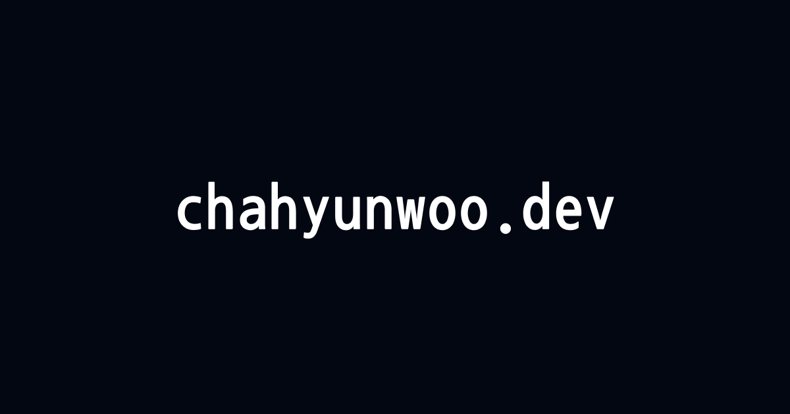
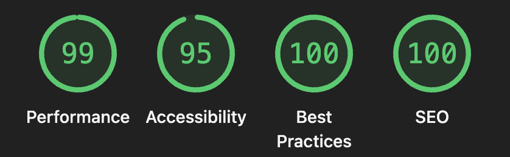

<div align="center">



<br />
<br />

# 🌐 hyunwoo.dev

*"Write code, share stories."*

**Dev. Cha Hyunwoo** | Full-Stack Developer

<br />

[](https://chahyunwoo.dev)

<br />

[](https://github.com/chahyunwoo/hyunwoo-blog-nextjs/actions/workflows/ci.yml)
[](https://github.com/chahyunwoo/hyunwoo-blog-nextjs/actions/workflows/codeql.yml)
[](./LICENSE)

</div>

<br />

---

<br />

## ⚡ 기술 스택

<table>
  <tr>
    <td align="center" width="96">
      
      <br />Next.js 16
    </td>
    <td align="center" width="96">
      
      <br />React 19
    </td>
    <td align="center" width="96">
      
      <br />TypeScript
    </td>
    <td align="center" width="96">
      
      <br />Tailwind 4
    </td>
    <td align="center" width="96">
      
      <br />Vercel
    </td>
  </tr>
</table>

| 분류 | 기술 |
|:-----|:-----|
| 🖥️ Framework | Next.js 16 (App Router, Turbopack) |
| 📝 Content | MDX ([next-mdx-remote](https://github.com/hashicorp/next-mdx-remote) v6) |
| 🎨 Styling | Tailwind CSS 4, [shadcn/ui](https://ui.shadcn.com) |
| ✨ Code Highlight | [Shiki](https://shiki.matsu.io) + rehype-pretty-code |
| 🗂️ State | [Zustand](https://zustand-demo.pmnd.rs) |
| 🔍 Search | [cmdk](https://cmdk.paco.me) (Cmd+K 커맨드 팔레트) |
| 🧪 Testing | [Vitest](https://vitest.dev) + Testing Library |
| 🔧 Lint & Format | [Biome](https://biomejs.dev) |
| 📦 Package Manager | [pnpm](https://pnpm.io) |
| 🔍 SEO | sitemap, robots.txt, JSON-LD, Open Graph |
| 🛡️ Security | CodeQL, Dependabot |
| 📊 Quality | Lighthouse CI, release-please |

<br />

## ✨ 주요 기능

| 기능 | 설명 |
|:-----|:-----|
| 📄 MDX 블로그 | 코드 하이라이팅, GFM, 커스텀 컴포넌트 지원 |
| 🔍 검색 | `Cmd+K` 커맨드 팔레트로 포스트 검색 (디바운스, 카테고리별 그룹핑) |
| 🏷️ 카테고리 & 태그 | 사이드바 카테고리 아이콘, 태그 클라우드, 필터링 |
| 📑 페이지네이션 | 포스트 리스트 페이지 단위 탐색 |
| 📖 목차 (TOC) | PC: 우측 sticky TOC / 모바일: 플로팅 버튼 + 바텀시트 |
| 📊 읽기 프로그레스 | 포스트 상단 읽기 진행률 바 |
| 🌏 다국어 소개 | 한국어 / English / 日本語 |
| 🌙 다크 모드 | 시스템 테마 연동 + 수동 전환 (Indigo-Violet 테마) |
| 🔍 SEO 최적화 | sitemap, robots.txt, JSON-LD, Open Graph, canonical URL |
| 📱 반응형 디자인 | 모바일 ~ 데스크탑 완벽 대응 |

<br />

## 🏆 Lighthouse

<div align="center">
  
</div>

<br />

| Category | Score |
|:---------|:------|
| 🟢 Performance | **99** |
| 🟢 Accessibility | **95** |
| 🟢 Best Practices | **100** |
| 🟢 SEO | **100** |

<br />

## 🚀 시작하기

```bash
# 의존성 설치
pnpm install

# 개발 서버 실행 (Turbopack)
pnpm dev

# 프로덕션 빌드
pnpm build

# 린트 & 포맷
pnpm lint        # 자동 수정
pnpm lint:ci     # CI용 (수정 없이 검사만)

# 테스트
pnpm test        # watch 모드
pnpm test:run    # 단일 실행
```

> 개발 서버는 기본적으로 `http://localhost:3000`에서 실행됩니다.

<br />

## 📁 프로젝트 구조

```
src/
├── 📂 app/            # Next.js App Router 페이지 및 라우팅
│   ├── about/         # 다국어 소개 페이지 (ko, en, jp)
│   ├── blog/          # 블로그 포스트 상세 페이지
│   └── layout.tsx     # 루트 레이아웃
├── 📂 components/     # 재사용 컴포넌트
│   ├── common/        # 공통 컴포넌트 (CopyButton 등)
│   ├── features/      # 기능별 컴포넌트
│   │   ├── about/     # 프로필, 경력, 스킬, 프로젝트
│   │   ├── blog/      # 포스트 카드, TOC, 프로그레스 바, 사이드바
│   │   ├── navigation/# 카테고리 네비게이터, 메뉴
│   │   └── search/    # Cmd+K 검색 커맨드 팔레트
│   ├── layout/        # 헤더, 푸터, 컨테이너
│   ├── mdx/           # MDX 커스텀 컴포넌트
│   ├── skeleton/      # 로딩 스켈레톤
│   └── ui/            # shadcn/ui 컴포넌트
├── 📂 data/           # 다국어 프로필 데이터 (i18n)
├── 📂 lib/            # 유틸리티 함수, 상수
├── 📂 posts/          # MDX 블로그 포스트
├── 📂 services/       # 데이터 서비스 (포스트 조회 등)
├── 📂 stores/         # Zustand 스토어 (검색 상태 등)
├── 📂 styles/         # 글로벌 CSS, 테마 변수
├── 📂 types/          # TypeScript 타입 정의
└── 📂 __tests__/      # Vitest 테스트 파일
```

<br />

## 📝 블로그 포스트 작성

`src/posts/` 디렉토리에 MDX 파일을 추가하면 자동으로 블로그에 반영됩니다.

```yaml
---
title: "포스트 제목"
description: "간단한 설명"
date: "2026-03-20"
mainTag: "Frontend"
tags: ["React", "TypeScript"]
thumbnail: /thumbnail/post-slug.png
published: true
---
```

### 지원하는 MDX 컴포넌트

| 컴포넌트 | 용도 |
|:---------|:-----|
| `<Callout>` | 팁, 정보, 경고 박스 (`tip`, `info`, `warning`) |
| `<Highlight>` | 텍스트 강조 (색상 커스텀 지원) |
| `<MdxImage>` | 캡션이 있는 최적화 이미지 |
| `<MdxLink>` | 외부 링크 (새 탭 자동 처리) |
| `<Icon>` | 인라인 아이콘 렌더링 |
| Code Block | 파일명 표시, 라인 하이라이팅 지원 |

<br />

## 🤝 기여하기

버그를 발견하셨거나 새로운 기능을 제안하고 싶으시다면 언제든 환영합니다!

1. [Issues](https://github.com/chahyunwoo/hyunwoo-blog-nextjs/issues)에서 버그 리포트 또는 기능 요청
2. Fork 후 `feature/*` 브랜치에서 작업
3. PR 제출 시 CI 자동 실행 (Biome lint, type-check, Vitest, build, Lighthouse)

<br />

## ⭐ Star

이 프로젝트의 소스코드는 MIT 라이선스로 공개되어 있습니다.

코드를 참고하셨다면 **Star**를 눌러주시면 큰 힘이 됩니다! 감사합니다. 🙏

[](https://github.com/chahyunwoo/hyunwoo-blog-nextjs)

<br />

## 📄 라이선스

[MIT License](./LICENSE) &copy; 2025-present [Hyunwoo Cha](https://github.com/chahyunwoo)
